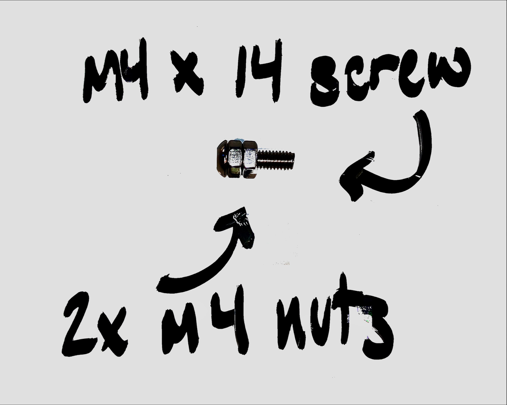
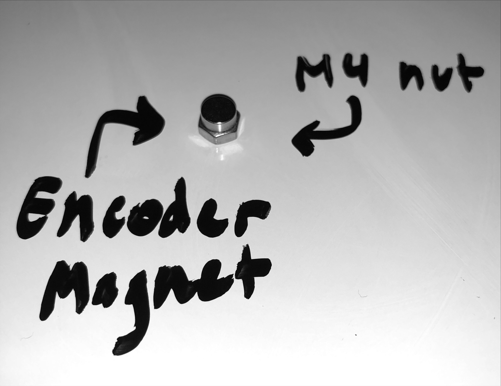
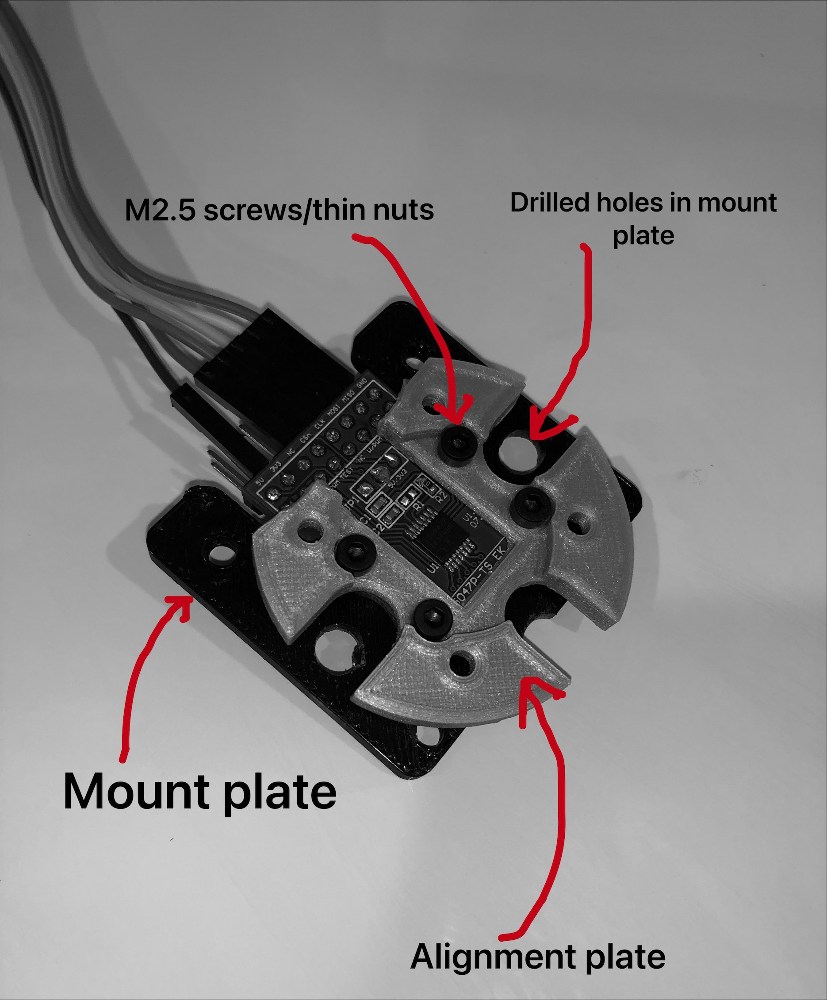

- [1. ODRIVE BASIC SETUP:](#1-odrive-basic-setup)
  - [## 1.1. Introduction:](#-11-introduction)
  - [## 1.2. Parts List:](#-12-parts-list)
    - [1.2.1. ODrive Parts:](#121-odrive-parts)
    - [1.2.2. Per motor parts:](#122-per-motor-parts)
    - [1.2.3. Other Parts/Tools:](#123-other-partstools)
- [2. Assembly](#2-assembly)
  - [2.1. Encoder Module Assembly](#21-encoder-module-assembly)
    - [2.1.1. Encoder Resistor Configuration](#211-encoder-resistor-configuration)
    - [2.1.2. Encoder Voltage Selector](#212-encoder-voltage-selector)
    - [2.1.3. Encoder Header Pin](#213-encoder-header-pin)
    - [2.1.4. Encoder Magnet Assembly](#214-encoder-magnet-assembly)
    - [2.1.5. Mounting the Encoder](#215-mounting-the-encoder)
    - [2.1.6. Putting it All Together](#216-putting-it-all-together)
- [3. Setting up the ODrive Board and connecting motors and encoders](#3-setting-up-the-odrive-board-and-connecting-motors-and-encoders)
    - [3.0.1. Powering the Odrive](#301-powering-the-odrive)
    - [3.0.2. Wiring the Encoder and Motor](#302-wiring-the-encoder-and-motor)
- [4. Anaconda/Odrivetool Setup and Config](#4-anacondaodrivetool-setup-and-config)
  - [4.1. Downloading and Installing Tools](#41-downloading-and-installing-tools)
    - [4.1.1. Windows](#411-windows)
    - [4.1.2. OSX](#412-osx)
  - [4.2. Start `odrivetool`](#42-start-odrivetool)
- [5. ODrive Calibration](#5-odrive-calibration)
  - [5.1. Motor Configuration](#51-motor-configuration)
  - [5.2. Encoder Calibration](#52-encoder-calibration)
  - [5.3. Motor Calibration and Startup](#53-motor-calibration-and-startup)
  
# 1. ODRIVE BASIC SETUP:
## 1.1. Introduction:
---
ODrive allows for precise control of up to 2 BLDC motors and 2 rotary encoders. The ODrive can be interfaced with through a microcontroller such as an Arduino or Teensy board to run control loops. For any questions regarding setup, contact John Bush (johncbus@usc.edu) or through slack message
## 1.2. Parts List:
---
### 1.2.1. ODrive Parts:
- [ ] 3x heat sinks per motor installed
- [ ] (if not already on the ODrive board) 2x 3 terminal block connectors
- [ ] 10-12AWG wire for power cable
- [ ] 2x banana plugs
- [ ] 1x Female pin header 
- [ ] *OPTIONAL:* 2x XT60 connector pairs
### 1.2.2. Per motor parts:
- [ ] 1x U8II KV150 BLDC motor (or similar motor)
- [ ] 1x AS5047P rotary encoder board and included magnet (AS5047P-TS_EK_AB)
- [ ] 1x 0 ohm 0603 package resistor (if you fry the one included on the encoder)
- [ ] 1x Encoder mounting plate (redesigned plate in progress)
- [ ] 1x motor mount
- [ ] 4x M2.5 x 8mm socket head screws
- [ ] 4x M2.5 Thin type nuts
- [ ] 1x M4 x 10mm screw
- [ ] 1x M4 x 14mm screw
- [ ] 2x M4 x 18mm screws
- [ ] 4x M4 x 30mm screws (can be other length, just to stand off the motor from the ground)
- [ ] 7x M4 nuts 
### 1.2.3. Other Parts/Tools:
- [ ] Soldering iron
- [ ] fine solder
- [ ] assorted jumper cables
- [ ] header pins
- [ ] super glue
- [ ] wire stripper
- [ ] Allen keys/hex wrenches
- [ ] file/sandpaper

# 2. Assembly
## 2.1. Encoder Module Assembly
**NOTE: "front" refers to the side with pin labels and the actual encoder chip, while "back" refers to the side with the serial number sticker.**
### 2.1.1. Encoder Resistor Configuration
1. The AS5047P encoder package is made to work in either a 3.3V or 5V (default) power configuration, and for our purposes we need to select the 3.3V operation setting. On the eval board, notice the 0 ohm 0603 package resistor at R1 on the front of the board. 
   1. First, desolder the resistor at R1
   2. Solder the 0 ohm resistor to R2. *(if damaged, replace the resistor)*
### 2.1.2. Encoder Voltage Selector
1. Next we need to set the voltage selector at JP1.
   1. Desolder and remove the header pins in JP1, since they will otherwise interfere with the motor  
   2. Next either:
      1. Resolder the JP1 header pins so that they protrude from the **back** of the board and then connect the 5V and 3.3V pins or,
      2. Solder a jumper wire between [5V] and [3.3V] on the **back** of the board.
### 2.1.3. Encoder Header Pin
1. Solder the 2x8 pin header so that it protrudes from the **back** of the board.
### 2.1.4. Encoder Magnet Assembly
1. Take an M4 x 14mm screw and screw 2 nuts fully onto it to act as spacers.
   
2. Take a third M4 nut and **CAREFULLY** glue the provided encoder magnet onto one side of the nut, making sure to center the magnet on the nut. 
   1. **NOTE: IT IS CRUCIAL THAT THIS MAGNET IS CENTERED WITHIN 0.5mm** 
   
3. Remove the plastic dust cover from the bottom of the U8II motor.
4. From the top side of the motor, drop the M4 screw assembly into the center, through the hole in the center of the motor. From the bottom side, screw on the magnet-nut assembly and tighten the nut onto the screw with an allen key and hex wrench.
### 2.1.5. Mounting the Encoder
1. Mounting the encoder to the encoder mounts **Note: this part will be updated once I redesign the encoder mount**
   1. If needed to be done before John redesigns the encoder mount, ask John how to do this part.
2. Attach a ribbon of 6 jumper cables to the following pins of the encoder header in the following order for future simplicity:
   1. 3V3
   2. CLK
   3. MISO
   4. MOSI
   5. CSn
   6. GND

### 2.1.6. Putting it All Together
7. Attach the motor mount to the motor with one M4 x 14mm screw into the second of the three motor mounting holes
8. Attach the encoder module with two M4 x 18mm screws through the encoder module and the other two motor mounting holes. 
9. Attach the motor mount to a board or install standoffs through the four outer mounting points as desired

# 3. Setting up the ODrive Board and connecting motors and encoders
### 3.0.1. Powering the Odrive
1. Power Cable Assembly (case dependent)
   1. The ODrive 24V v3.6 needs a 12-24V power supply to the "DC +/-" terminals
   2. I built one with 10AWG wire from the board to an XT60 connector, and then a longer cable from the XT60 connector to the power supply with banana plugs on the end.
2. Solder block connectors to the M0 and M1 connection terminals
### 3.0.2. Wiring the Encoder and Motor
1. Connect the motor power wires to the block terminals (for the U8II, the motor wires are in the order they need to be connected to the ODrive)
2. Connect the Encoder wires as follows (AS5047P -> ODrive):
   1. 3.3V -> 3.3V
   2. CSn -> GPIO7 (can be connected to any GPIO pin #3-8, just change motor setup accordingly) 
   3. CLK -> SCK
   4. MISO -> MISO
   5. MOSI -> MOSI
   6. GND -> GND
   
# 4. Anaconda/Odrivetool Setup and Config
*NOTE: For more additional setup information, consult the **[ODrive Documentation](https://docs.odriverobotics.com/)***
*<br>The following is copied from the ODrive Documentation. I recommend reading the Getting Started Guide before continuing*
## 4.1. Downloading and Installing Tools
Most instructions in this guide refer to a utility called `odrivetool`, so you should install that first.
### 4.1.1. Windows
1. Install Python 3. We recommend the Anaconda distribution because it packs a lot of useful scientific tools, however you can also install the standalone python.
  * __Anaconda__: Download the installer from [here](https://www.anaconda.com/download/#windows). Execute the downloaded file and follow the instructions.
  * __Standalone Python__: Download the installer from [here](https://www.python.org/downloads/). Execute the downloaded file and follow the instructions.
  * If you have Python 2 installed alongside Python 3, replace `pip` by `C:\Users\YOUR_USERNAME\AppData\Local\Programs\Python\Python36-32\Scripts\pip`. If you have trouble with this step then refer to [this walkthrough](https://www.youtube.com/watch?v=jnpC_Ib_lbc).
2. Launch the command prompt.
  * __Anaconda__: In the start menu, type `Anaconda Prompt` <kbd>Enter</kbd>
  * __Standalone Python__: In the start menu, type `cmd` <kbd>Enter</kbd>
3. Install the ODrive tools by typing `pip install --upgrade odrive` <kbd>Enter</kbd>


### 4.1.2. OSX
We are going to run the following commands for installation in Terminal.
1. If you don't already have it, install homebrew:
```bash
/usr/bin/ruby -e "$(curl -fsSL https://raw.githubusercontent.com/Homebrew/install/master/install)"
```
2. Install python:
```bash
brew install python
```
3. If you get the error: `Error: python 2.7.14_2 is already installed`, then upgrade to Python 3 by running:
```bash
brew upgrade python
```
4. The odrive tools uses libusb to communicate to the ODrive:
```bash
brew install libusb
```
5. Now that you have Python 3 and all the package managers, run:
```bash
pip3 install --upgrade odrive
```
## 4.2. Start `odrivetool`
To launch the main interactive ODrive tool, type `odrivetool` <kbd>Enter</kbd>. Connect your ODrive and wait for the tool to find it. If it doesn't connect after a few seconds refer to the [troubleshooting page](troubleshooting.md#usb-connectivity-issues). Now you can, for instance type `odrv0.vbus_voltage` <kbd>Enter</kbd> to inpect the boards main supply voltage.
It should look something like this:

```text
ODrive control utility v0.5.1
Please connect your ODrive.
Type help() for help.

Connected to ODrive 306A396A3235 as odrv0
In [1]: odrv0.vbus_voltage
Out[1]: 11.97055721282959
```
# 5. ODrive Calibration
*Note: The following is a sample calibration for moderately low power application*
The following commands will configure the U8II and AS5047P to 
## 5.1. Motor Configuration
```
odrv0.axis0.motor.config.current_lim = 15
odrv0.axis0.controller.config.vel_limit = 10
odrv0.axis0.motor.config.calibration_current = 15
odrv0.axis0.motor.config.pole_pairs = 21
odrv0.axis0.motor.config.torque_constant = 0.055
odrv0.axis0.motor.config.motor_type = MOTOR_TYPE_HIGH_CURRENT
```
## 5.2. Encoder Calibration
The GPIO pin configuration has to correspond to the GPIO pin the encoder is connected to. GPIO pins 1 and 2 are reserved for UART communication from the Teensy Board.
```
odrv0.axis0.encoder.config.abs_spi_cs_gpio_pin = 7  # or which ever GPIO pin you choose
odrv0.axis0.encoder.config.mode = ENCODER_MODE_SPI_ABS_AMS
odrv0.axis0.encoder.config.cpr = 2**14
odrv0.save_configuration()
odrv0.reboot()
```

## 5.3. Motor Calibration and Startup
```
odrv0.axis0.requested_state = AXIS_STATE_FULL_CALIBRATION_SEQUENCE
odrv0.axis0.requested_state = AXIS_STATE_ENCODER_OFFSET_CALIBRATION
odrv0.save_configuration()
odrv0.reboot()

odrv0.axis0.requested_state = AXIS_STATE_CLOSED_LOOP_CONTROL

odrv0.axis0.controller.input_pos = 1 # example of positional control
```